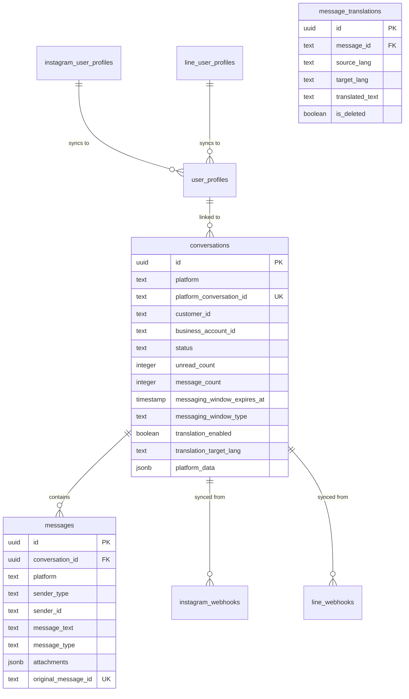

# AllChat - 통합 메신저 상담 관리 시스템 완전 가이드

## 📌 서비스 개요

**AllChat**은 여러 메시징 플랫폼(Instagram, LINE, 향후 카카오톡/WhatsApp)의 고객 메시지를 하나의 통합 인터페이스에서 관리할 수 있는 B2B SaaS 솔루션입니다.

### 핵심 가치
- **통합 관리**: 모든 메신저를 한 곳에서
- **실시간 대응**: 고객 메시지 즉시 확인 및 답변
- **효율적 워크플로우**: 상태 기반 상담 프로세스
- **확장 가능**: 새로운 플랫폼 쉽게 추가

### 타겟 고객
- 여러 SNS 채널을 운영하는 기업
- 고객 상담이 중요한 이커머스 업체
- 글로벌 고객을 대상으로 하는 서비스

---

## 🛠 기술 스택

### Frontend
- **Framework**: Next.js 15.1.4 (App Router)
- **Language**: TypeScript 5
- **Styling**: Tailwind CSS v4
- **Build Tool**: Turbopack
- **Real-time**: Supabase Realtime Client
- **State Management**: React Hooks (useState, useRef, useEffect)

### Backend
- **Runtime**: Node.js 20+
- **API**: Next.js API Routes
- **Database**: Supabase (PostgreSQL 16)
- **Authentication**: SHA256 HMAC (Webhook 검증)

### External APIs
- **Instagram**: Graph API v23.0
- **LINE**: Messaging API
- **Webhook**: Meta Webhook, LINE Webhook

---

## 🏗 시스템 아키텍처

### 전체 데이터 플로우

```
[고객] → [메신저 앱] → [플랫폼 서버] → [Webhook] → [AllChat]
                                                        ↓
[상담원] ← [AllChat UI] ← [Realtime] ← [Database] ← [API Routes]
```

### 상세 플로우

#### 1. 메시지 수신 (Inbound)
```
1. 고객이 Instagram/LINE에서 메시지 전송
2. 플랫폼이 Webhook으로 이벤트 전달
   - Instagram: /api/webhooks/instagram
   - LINE: /api/webhooks/line
3. Webhook 검증 및 처리
   - 서명 검증 (HMAC SHA256)
   - 데이터 파싱 및 정규화
4. 데이터베이스 저장
   - platform_webhooks 테이블에 원본 저장
   - 트리거로 conversations 자동 업데이트
5. Realtime 이벤트 발생
   - Supabase Realtime이 UPDATE 이벤트 브로드캐스트
6. 프론트엔드 즉시 업데이트
   - WebSocket으로 실시간 수신
   - UI 자동 갱신
```

#### 2. 메시지 전송 (Outbound)
```
1. 상담원이 UI에서 메시지 작성
2. API 호출
   - Instagram: /api/messages/instagram/send
   - LINE: /api/messages/line/send
3. 플랫폼 API 호출
   - Instagram Graph API
   - LINE Messaging API
4. 전송 결과 처리
   - 성공: Echo webhook으로 확인
   - 실패: 에러 표시 및 재시도 옵션
```

---

## 💾 데이터베이스 설계

### 테이블 구조 및 관계



### 핵심 테이블 상세

#### 1. conversations (통합 대화 관리)
- **역할**: 모든 플랫폼의 대화 통합 관리
- **특징**: Single Source of Truth for 상태 관리
- **주요 필드**:
  - `platform`: 'instagram', 'line' 등
  - `status`: 'pending', 'in_progress', 'completed'
  - `unread_count`: 읽지 않은 메시지 수
  - `messaging_window_expires_at`: 메시징 윈도우 만료 시간 (Instagram만)
  - `messaging_window_type`: 'standard' (Instagram) 또는 NULL (LINE)
  - `translation_enabled`: 번역 기능 활성화 여부
  - `translation_target_lang`: 번역 대상 언어 (KO, EN, JA, ZH 등)
  - `platform_data`: 플랫폼별 추가 데이터 (JSONB)

#### 2. messages (통합 메시지 관리)
- **역할**: 모든 플랫폼의 메시지 통합 저장
- **특징**: 중복 방지, 플랫폼 독립적 구조
- **주요 필드**:
  - `conversation_id`: 대화 참조 (FK)
  - `sender_type`: 'customer', 'business', 'system'
  - `message_type`: 'text', 'image', 'video', 'audio', 'file', 'sticker' 등
  - `attachments`: 미디어 및 메타데이터 (JSONB)
  - `original_message_id`: 플랫폼 원본 메시지 ID (중복 방지)

#### 3. instagram_webhooks
- **역할**: Instagram 웹훅 이벤트 원본 저장
- **특징**: 모든 이벤트 타입 지원
- **이벤트 타입**:
  - `message`: 일반 메시지
  - `reaction`: 반응 이모지
  - `postback`: 버튼 클릭
  - `read`: 읽음 확인
  - `referral`: 광고 유입

#### 4. line_webhooks / line_sent_messages
- **역할**: LINE 메시지 송수신 관리
- **특징**: 그룹/룸 대화 지원
- **구분**: user_id, group_id, room_id로 대화 타입 구분

#### 5. instagram_user_profiles / line_user_profiles
- **역할**: 플랫폼별 사용자 프로필 캐싱
- **특징**: user_profiles 테이블로 자동 동기화
- **캐시**: 24시간 주기로 갱신

#### 6. message_translations (메시지 번역 관리)
- **역할**: 메시지 번역 내용 저장 및 관리
- **특징**: 소프트 삭제 지원, 다국어 지원
- **주요 필드**:
  - `message_id`: 원본 메시지 참조
  - `source_lang`: 원본 언어
  - `target_lang`: 번역 대상 언어
  - `translated_text`: 번역된 텍스트
  - `is_deleted`: 소프트 삭제 플래그

---

## ⚙️ 트리거 시스템

### Instagram 트리거 (통합)

#### sync_instagram_all_in_one_trigger
```sql
-- 실행 시점: instagram_webhooks INSERT 후
-- 기능: 모든 대화 관련 처리를 한 번에

1. is_echo 기반 고객/비즈니스 ID 자동 판별
2. conversation_id 생성 (작은ID_큰ID 형식)
3. instagram_conversations 업데이트
4. conversations 통합 테이블 동기화
5. unread_count, status 관리
```

### LINE 트리거

#### sync_line_to_unified_conversations
```sql
-- 실행 시점: line_webhooks/line_sent_messages INSERT 후
-- 기능: LINE 메시지를 conversations로 동기화

1. conversation_id 결정 (user/group/room)
2. 프로필 정보 조회
3. conversations 업데이트
4. 고객 메시지면 unread_count 증가
```

---

## 🎨 UI/UX 구조

### 3컬럼 레이아웃

```
┌──────────────────────────────────────────────────┐
│                   Header (AllChat)                │
├─────────────┬──────────────────┬─────────────────┤
│             │                  │                 │
│   대화목록   │     채팅창       │   상담도구      │
│   (25%)     │     (50%)       │    (25%)       │
│             │                  │                 │
│ - 상태 탭    │ - 메시지 타임라인  │ - AI 어시스턴트  │
│ - 대화 카드  │ - 입력창         │ - 템플릿       │
│ - 검색      │ - 상태 변경 버튼  │ - 고객 정보     │
│             │                  │                 │
└─────────────┴──────────────────┴─────────────────┘
```

---

## 🧩 컴포넌트 시스템

### 컴포넌트 아키텍처

```
ConversationsPage (메인 컨테이너)
├── ConversationsList (왼쪽 패널)
│   ├── 상태별 탭 필터
│   ├── 대화 카드 목록
│   └── UserProfileCard (미니)
├── ConversationView (중앙 패널)
│   ├── 메시지 타임라인
│   ├── 메시지 입력창
│   └── 상태 변경 버튼
└── ConsultationAssistant (오른쪽 패널)
    └── 상담 도구 (예정)
```

### 주요 컴포넌트 상세

#### 1. ConversationsPage
- **역할**: 전체 레이아웃 관리
- **기능**:
  - 3컬럼 레이아웃 구조
  - 선택된 대화 상태 관리
  - 상담 완료 시 채팅창 자동 닫기

#### 2. ConversationsList
- **기능**: 대화 목록 표시 및 필터링
- **특징**:
  - 상태별 탭 (진행중/전체/완료)
  - 실시간 카운트 업데이트
  - 플랫폼 아이콘 표시 (Instagram/LINE)
  - Debouncing 적용 (최적화 버전)
  - statusFilterRef 사용 (리렌더링 최소화)
  - **Skeleton UI 로딩** (2025-08-30 추가)
  - **상태 카운트 실시간 업데이트 개선** (2025-08-30)
- **API 호출**:
  - GET `/api/conversations`
  - GET `/api/conversations/status-counts`

#### 3. ConversationView
- **기능**: 채팅 인터페이스
- **특징**:
  - 플랫폼별 분기 처리
  - 실시간 메시지 수신
  - 낙관적 업데이트
  - 미디어 고정 높이 (Layout Shift 방지)
  - IntersectionObserver로 무한 스크롤
  - unread_count 자동 리셋
  - **실시간 번역 기능** (2025-08-30 추가)
  - **WhatsApp 스타일 입력 영역** (2025-08-30 추가)
- **번역 기능**:
  - 메시지 클릭으로 번역 팝업 표시
  - 번역 설정으로 자동 번역 활성화
  - 번역된 메시지 인라인 표시
  - 번역 삭제 기능
- **WhatsApp 스타일 입력 영역**:
  - 둥근 입력창 디자인
  - 최대 4줄 자동 확장
  - 커스텀 스크롤바 (4px 너비)
  - 컴팩트한 버튼 배치
- **스크롤 로직**: [📜 스크롤 로직 상세 섹션 참조]

#### 4. ConsultationAssistant
- **기능**: 상담 지원 도구 패널
- **현재 상태**: UI 프레임만 구현
- **예정 기능**:
  - 자동 응답 템플릿
  - AI 답변 추천
  - 고객 이력 조회
  - 메모 및 태그

#### 5. MessageSender
- **기능**: 독립적인 메시지 전송 컴포넌트
- **지원 메시지 타입**:
  - 텍스트 메시지
  - 미디어 (이미지, GIF, 비디오, 오디오)
  - 스티커 (Like Heart)
  - 리액션 (❤️ Love, 😮 Wow, 😢 Sad, 😠 Angry, 👍 Like, 😂 Haha)
  - 포스트 공유
- **고급 설정**:
  - 커스텀 액세스 토큰
  - 비즈니스 ID 지정

#### 6. ProfileManager
- **기능**: Instagram 사용자 프로필 통합 관리
- **특징**:
  - 실시간 프로필 업데이트 구독
  - 필터링 (인증 계정, 팔로잉)
  - 정렬 (최근 메시지, 팔로워, 메시지 수)
  - 배치 프로필 갱신
  - 프로필별 메모 저장
- **통계 표시**:
  - 전체 프로필 수
  - 인증 계정 수
  - 팔로잉/팔로워 수
  - 업데이트 필요 프로필

#### 7. UserProfileCard
- **기능**: 재사용 가능한 프로필 카드
- **표시 정보**:
  - 프로필 사진 (폴백 처리)
  - 이름/사용자명
  - 인증 배지
  - 팔로워 수 (1K, 1M 포맷)
  - 팔로우 관계 (팔로잉, 맞팔로우)
  - 마지막 업데이트 시간
- **모드**:
  - 간단 모드 (showDetails=false)
  - 상세 모드 (showDetails=true)

#### 8. WebhookDashboard
- **기능**: 실시간 웹훅 모니터링
- **특징**:
  - 실시간 웹훅 수신 표시
  - 웹훅 타입별 색상 구분
  - 첨부파일 아이콘 표시
  - 원본 데이터 뷰어
  - 브라우저 알림 지원
- **웹훅 타입 색상**:
  - message: 파란색
  - reaction: 보라색
  - postback: 초록색
  - read: 회색
  - referral: 노란색
  - ephemeral: 주황색

---

## 🔄 실시간 처리

### Supabase Realtime 구독

```typescript
// conversations 테이블 구독
const channel = supabase
  .channel('conversations-updates')
  .on(
    'postgres_changes',
    { 
      event: 'UPDATE', 
      schema: 'public', 
      table: 'conversations'
    },
    (payload) => {
      // 실시간 업데이트 처리
      handleRealtimeUpdate(payload.new)
    }
  )
  .subscribe()
```

### 플랫폼별 메시지 구독

```typescript
// Messages 테이블 통합 구독
const messagesChannel = supabase
  .channel('messages-stream')
  .on(
    'postgres_changes',
    {
      event: 'INSERT',
      schema: 'public',
      table: 'messages',
      filter: `conversation_id=eq.${conversationId}`
    },
    (payload) => {
      handleNewMessage(payload.new)
    }
  )
  .subscribe()
```

### Unread Count 리셋 (2025-08-29 구현)

```typescript
// 대화창 진입 시 unread_count를 0으로 리셋
async function markConversationAsRead(conversationId: string) {
  const response = await fetch(`/api/conversations/${conversationId}/mark-read`, {
    method: 'PATCH'
  })
  // conversations 테이블의 unread_count가 0으로 업데이트됨
}
```

### 다중 테이블 실시간 구독

```typescript
// ProfileManager - 프로필 업데이트 구독
const channel = supabase
  .channel('profiles-channel')
  .on(
    'postgres_changes',
    { 
      event: '*',  // INSERT, UPDATE, DELETE 모두
      schema: 'public', 
      table: 'instagram_user_profiles' 
    },
    handleProfileChange
  )
  .subscribe()

// WebhookDashboard - 웹훅 수신 구독
const webhookChannel = supabase
  .channel('webhooks-channel')
  .on(
    'postgres_changes',
    { 
      event: 'INSERT', 
      schema: 'public', 
      table: 'instagram_webhooks' 
    },
    handleNewWebhook
  )
  .subscribe()
```

---

## 👤 프로필 관리 시스템

### 프로필 캐싱 전략

- **캐시 주기**: 24시간
- **자동 갱신**: 캐시 만료 시 API 호출
- **수동 갱신**: 새로고침 버튼 제공
- **배치 처리**: 만료된 프로필 일괄 업데이트

### 프로필 데이터 구조

```typescript
interface UserProfile {
  igsid: string                    // Instagram Scoped ID
  name?: string                     // 표시 이름
  username?: string                 // 사용자명
  profile_pic?: string              // 프로필 사진 URL
  follower_count?: number           // 팔로워 수
  is_verified_user?: boolean        // 인증 배지
  is_user_follow_business?: boolean // 비즈니스를 팔로우
  is_business_follow_user?: boolean // 비즈니스가 팔로우
  has_user_consent?: boolean        // 사용자 동의 여부
  cache_expires_at?: string         // 캐시 만료 시간
  notes?: string                    // 관리자 메모
}
```

### API 엔드포인트

#### GET /api/profiles/[igsid]
- 개별 프로필 조회
- 캐시 확인 후 필요시 Instagram API 호출
- Query: `?refresh=true` 강제 갱신

#### POST /api/profiles/batch
- 배치 프로필 업데이트
- Body: `{ igsids: string[] }`
- 최대 50개씩 처리

---

## 📡 웹훅 모니터링

### 웹훅 타입 및 처리

| 타입 | 설명 | 색상 | 아이콘 |
|------|------|------|--------|
| message | 일반 메시지 | 파란색 | 💬 |
| reaction | 리액션 | 보라색 | 👍 |
| postback | 버튼 클릭 | 초록색 | 🔘 |
| read | 읽음 확인 | 회색 | ✓✓ |
| referral | 광고 유입 | 노란색 | 🔗 |
| ephemeral | 임시 미디어 | 주황색 | 🕐 |

### 첨부파일 타입

```typescript
const attachmentIcons = {
  image: '🖼️',
  video: '🎥',
  audio: '🎵',
  file: '📎',
  story_mention: '📸',
  ig_reel: '🎬'
}
```

### 실시간 알림

```typescript
// 브라우저 알림 권한 요청
if ('Notification' in window) {
  Notification.requestPermission()
}

// 새 웹훅 수신 시 알림
new Notification('Instagram Webhook', {
  body: webhook.message_text,
  icon: '/icon.png'
})
```

---

## 📊 상태 관리 시스템

### 대화 상태 (Status)

```
pending (대기)
    ↓ [상담원 배정]
in_progress (진행중)
    ↓ [상담 완료]
completed (완료)
    ↓ [고객 메시지]
in_progress (자동 재개)
```

### 상태별 UI 표현
- **pending**: 주황색 왼쪽 테두리
- **in_progress**: 파란색 왼쪽 테두리  
- **completed**: 회색 배경

### 읽음 처리 (Unread Count)
- 고객 메시지: unread_count +1
- 상담원 메시지: 변경 없음
- 대화창 열기: 0으로 리셋

---

## 🚀 최적화 작업

### 2025-08-28 최적화
1. **트리거 통합**
   - **Before**: 3개 트리거 → UPDATE 3번
   - **After**: 1개 트리거 → UPDATE 1번
   - **개선**: 66% 감소

2. **API 호출 최소화**
   - **Before**: Realtime 이벤트 → API 재호출
   - **After**: Realtime 데이터 직접 사용
   - **개선**: 네트워크 비용 제거

3. **플랫폼 판별 개선**
   - **Before**: `conversationId.includes('_')`
   - **After**: `platform` 컬럼 사용 (SSOT)
   - **개선**: 신뢰성 향상

### 2025-08-29 스크롤 및 미디어 최적화
1. **미디어 요소 고정 높이 적용**
   - **문제**: 이미지/비디오 로드 시 Layout Shift로 스크롤 위치 틀어짐
   - **해결**: 모든 미디어에 고정 높이 적용
   - **구현**:
     ```tsx
     // 이미지: 300px 고정 높이
     style={{ height: '300px', objectFit: 'contain' }}
     
     // 비디오: 300px 고정 높이
     style={{ height: '300px', objectFit: 'contain' }}
     
     // 오디오: 54px 고정 높이
     style={{ height: '54px' }}
     ```
   - **효과**: Layout Shift 완전 제거, 스크롤 계산 정확도 100%

2. **Unread Count 리셋 로직**
   - **구현**: 대화창 진입 시 자동으로 unread_count를 0으로 리셋
   - **API**: PATCH `/api/conversations/[id]/mark-read`
   - **효과**: 읽음 상태 즉시 반영

### 2025-08-30 번역 기능 및 UI 개선
1. **실시간 번역 기능 구현**
   - **메시지 번역**: 개별 메시지 클릭으로 번역 팝업 표시
   - **자동 번역**: 대화별 번역 설정으로 자동 번역 활성화
   - **번역 관리**: 번역 삭제, 재번역 기능
   - **API**: Google Cloud Translation API 연동
   - **DB**: message_translations 테이블로 번역 캐싱

2. **WhatsApp 스타일 입력 영역**
   - **디자인**: 둥근 모서리 입력창 (rounded-3xl)
   - **자동 확장**: 최대 4줄까지 자동 높이 조절
   - **커스텀 스크롤바**: 4px 너비의 얇은 스크롤바
   - **최적화된 크기**: minHeight 30px, maxHeight 92px
   - **맞춤법 검사 비활성화**: spellCheck={false}

3. **Skeleton UI 로딩**
   - **프로필 로딩**: 프로필 정보 로딩 중 스켈레톤 UI 표시
   - **대화 목록**: 초기 로딩 시 스켈레톤 카드 표시
   - **사용자 경험**: 깜빡임 없는 부드러운 전환

4. **LINE 프로필 자동 로딩**
   - **구현**: 웹훅 처리 후 자동으로 프로필 API 호출
   - **효과**: 새 사용자 메시지 시 프로필 즉시 표시
   - **최적화**: 비동기 처리로 웹훅 응답 속도 유지

---

## 🌐 번역 시스템 상세 (2025-08-30 구현)

### 시스템 개요
실시간 메시지 번역 시스템으로 DeepL API를 활용하여 고객과 상담원 간의 언어 장벽을 해소합니다.

### 데이터베이스 구조

#### translations 테이블
```sql
CREATE TABLE translations (
  id UUID PRIMARY KEY DEFAULT gen_random_uuid(),
  message_id UUID REFERENCES messages(id) ON DELETE CASCADE,
  original_text TEXT NOT NULL,
  translated_text TEXT NOT NULL,
  source_lang VARCHAR(10),  -- NULL = 자동 감지
  target_lang VARCHAR(10) NOT NULL,
  translation_provider VARCHAR(20) DEFAULT 'deepl',
  response_time_ms INTEGER,
  character_count INTEGER,
  created_at TIMESTAMP WITH TIME ZONE DEFAULT NOW(),
  is_deleted BOOLEAN DEFAULT FALSE,  -- 소프트 삭제
  deleted_at TIMESTAMP WITH TIME ZONE
)
```

**인덱스**:
- `idx_translations_message`: message_id 조회용
- `idx_translations_message_cache`: 캐시 조회용 (message_id, target_lang, provider)
- `idx_translations_active`: 활성 번역 조회용 (is_deleted = false)
- `idx_translations_created`: 최근 번역 조회용

#### conversations 테이블 번역 설정
```sql
ALTER TABLE conversations ADD COLUMN
  translation_enabled BOOLEAN DEFAULT FALSE,
  translation_target_lang VARCHAR(10) DEFAULT NULL
```

**인덱스**:
- `idx_conversations_translation`: 번역 활성화된 대화 조회용

### API 구조

#### 1. DeepL Client (`/src/lib/deepl-client.ts`)
```typescript
class DeepLClient {
  // 싱글톤 패턴 구현
  translate(text, targetLang, options)     // 단일 번역
  translateBatch(texts, targetLang, options) // 배치 번역
  detectLanguage(text)                     // 언어 감지
  getSourceLanguages()                     // 지원 언어 목록
  getTargetLanguages()                     // 대상 언어 목록
  getUsage()                              // API 사용량 조회
  testConnection()                        // 연결 테스트
}
```

**특징**:
- Free/Pro 플랜 자동 감지 (API 키 suffix ':fx' 체크)
- 적절한 API URL 자동 선택
- 에러 핸들링 및 타입 안전성

#### 2. 번역 API (`/api/translation/translate`)
```typescript
POST /api/translation/translate
{
  text: string,
  targetLang: string,  // KO, EN, JA, ZH 등
  sourceLang?: string, // 자동 감지 가능
  messageId?: string   // 캐싱용
}

Response:
{
  success: boolean,
  result: { text: string, detected_source_language?: string },
  fromCache: boolean,    // 캐시 사용 여부
  reactivated?: boolean, // 소프트 삭제된 번역 재활성화
  responseTime: number
}
```

**캐싱 로직**:
1. message_id로 기존 번역 조회
2. 활성 번역 있으면 캐시에서 반환
3. 삭제된 번역 있으면 재활성화
4. 없으면 DeepL API 호출 후 저장

#### 3. 번역 삭제 API (`/api/translation/delete`)
```typescript
POST /api/translation/delete
{
  messageId: string,
  targetLang?: string  // 기본값 'KO'
}
```

**소프트 삭제**:
- `is_deleted = true`, `deleted_at = now()` 설정
- 데이터는 유지하되 조회에서 제외
- 재번역 시 자동 재활성화 (API 호출 없이)

#### 4. 대화 번역 설정 API (`/api/conversations/[id]/translation-settings`)
```typescript
GET /api/conversations/[id]/translation-settings
Response: {
  translation_enabled: boolean,
  translation_target_lang: string | null
}

PATCH /api/conversations/[id]/translation-settings
{
  translation_enabled: boolean,
  translation_target_lang: string
}
```

### 프론트엔드 구현 (`ConversationView.tsx`)

#### 상태 관리
```typescript
// 번역 설정 상태
const [translationEnabled, setTranslationEnabled] = useState(false)
const [translationTargetLang, setTranslationTargetLang] = useState('')
const [translations, setTranslations] = useState<Record<string, string>>({})
const [translatingMessageId, setTranslatingMessageId] = useState<string | null>(null)
```

#### 번역 워크플로우

##### 1. 개별 메시지 번역
```typescript
handleTranslate(messageId, messageText):
  1. 번역 중 상태 설정
  2. API 호출 (/api/translation/translate)
  3. 번역 결과를 translations 상태에 저장
  4. 메시지에 인라인으로 번역 표시
  5. 팝업 닫기
```

##### 2. 자동 번역 (메시지 전송 시)
```typescript
sendMessage():
  if (translationEnabled && translationTargetLang):
    1. 원본 메시지 전송
    2. 번역 API 호출
    3. 번역된 메시지도 자동 전송
    4. 대화 흐름 유지
```

##### 3. 번역 삭제
```typescript
handleDeleteTranslation(messageId):
  1. 삭제 API 호출
  2. translations 상태에서 제거
  3. UI 즉시 업데이트
  4. 재번역 시 캐시에서 복구
```

#### UI/UX 특징

##### 번역 팝업
- 메시지 클릭 시 상단에 팝업 표시
- 번역 있으면 "번역 삭제" 버튼
- 없으면 "번역하기" 버튼
- 번역 중 로딩 상태 표시

##### 번역 설정 모달
```html
<select>
  <option value="">사용 안함</option>
  <option value="EN">영어 (English)</option>
  <option value="JA">일본어 (日本語)</option>
  <option value="ZH">중국어 (中文)</option>
  <!-- 14개 언어 지원 -->
</select>
```

##### 시각적 피드백
- 번역 활성화 시:
  - 입력창 테두리 녹색
  - 번역 버튼 녹색
  - placeholder에 대상 언어 표시
- 번역된 메시지:
  - 회색 배경
  - 🌐 아이콘 표시
  - 원본과 구분되는 스타일

### 성능 최적화

#### 캐싱 전략
1. **DB 레벨 캐싱**
   - message_id + target_lang별 유니크 저장
   - 중복 API 호출 방지

2. **소프트 삭제 활용**
   - 삭제된 번역도 DB에 유지
   - 재번역 시 API 호출 없이 재활성화
   - 사용자 경험 개선 + 비용 절감

3. **프론트엔드 캐싱**
   - translations 상태로 메모리 캐싱
   - 페이지 이동 시까지 유지

#### 인덱스 최적화
- 복합 인덱스로 조회 성능 향상
- 활성 번역만 조회하는 부분 인덱스
- 최근 번역 조회용 시간 인덱스

### 지원 언어 (DeepL)
```typescript
const SUPPORTED_LANGUAGES = {
  'EN': '영어 (English)',
  'JA': '일본어 (日本語)',
  'ZH': '중국어 간체 (中文简体)',
  'ZH-TW': '중국어 번체 (中文繁體)',
  'ES': '스페인어 (Español)',
  'FR': '프랑스어 (Français)',
  'DE': '독일어 (Deutsch)',
  'RU': '러시아어 (Русский)',
  'PT': '포르투갈어 (Português)',
  'IT': '이탈리아어 (Italiano)',
  'NL': '네덜란드어 (Nederlands)',
  'PL': '폴란드어 (Polski)',
  'TR': '터키어 (Türkçe)',
  'AR': '아랍어 (العربية)'
}
```

### 마이그레이션 가이드

#### 필수 마이그레이션 순서
1. `create_translations_table.sql` - 번역 테이블 생성
2. `add_translation_settings_to_conversations.sql` - 대화 설정 추가
3. `add_soft_delete_to_translations.sql` - 소프트 삭제 추가
4. `migrate_translation_constraints.sql` - 제약 조건 최적화

#### 환경 변수 설정
```bash
DEEPL_API_KEY=your-api-key-here  # ':fx' suffix for free plan
```

### 모니터링 및 분석

#### 사용량 추적
```sql
-- 일별 번역 사용량
SELECT 
  DATE(created_at) as date,
  COUNT(*) as translation_count,
  SUM(character_count) as total_characters,
  AVG(response_time_ms) as avg_response_time
FROM translations
WHERE is_deleted = false
GROUP BY DATE(created_at)
ORDER BY date DESC;

-- 언어별 번역 통계
SELECT 
  source_lang,
  target_lang,
  COUNT(*) as count
FROM translations
WHERE is_deleted = false
GROUP BY source_lang, target_lang
ORDER BY count DESC;
```

#### 성능 모니터링
- API 응답 시간: response_time_ms 필드 추적
- 캐시 히트율: fromCache 플래그 모니터링
- 재활성화율: reactivated 플래그 추적

### 향후 개선 계획
1. **Google Translate API 지원** - 멀티 프로바이더
2. **번역 품질 피드백** - 사용자 평가 시스템
3. **용어집 관리** - 도메인별 전문 용어
4. **배치 번역** - 대화 전체 일괄 번역
5. **번역 히스토리** - 수정 이력 추적

---

## 📜 스크롤 로직 상세 (2025-08-29 구현)

### 대화방 진입 시 스크롤 플로우

#### Phase 1: 초기화 (대화 클릭)
```typescript
// ConversationsPage에서 대화 선택
setSelectedConversation(conversation)
// → ConversationView 컴포넌트 마운트
```

#### Phase 2: 메시지 로드
```typescript
// useEffect 실행 (conversationId 변경 감지)
const fetchMessages = async () => {
  // 1. 기존 메시지 초기화
  setMessages([])
  setHasMore(true)
  
  // 2. 최근 50개 메시지 로드
  const response = await fetch(`/api/conversations/${conversationId}/messages?limit=50`)
  const data = await response.json()
  
  // 3. 메시지 상태 업데이트
  setMessages(data.messages)
  setInitialLoadComplete(true)
}
```

#### Phase 3: 스크롤 실행
```typescript
// useLayoutEffect - DOM 업데이트 직후 실행
useLayoutEffect(() => {
  if (initialLoadComplete && !hasScrolledToBottom.current) {
    scrollToBottom()  // 최하단으로 즉시 스크롤
    hasScrolledToBottom.current = true
  }
}, [initialLoadComplete])
```

#### Phase 4: 미디어 렌더링
```typescript
// 모든 미디어 요소는 고정 높이로 렌더링
// Layout Shift 없이 정확한 스크롤 위치 유지

// 이미지


// 비디오  
<video style={{ height: '300px', objectFit: 'contain' }} />

// 오디오
<audio style={{ height: '54px' }} />
```

### 추가 스크롤 시나리오

1. **과거 메시지 로드 (스크롤 업)**
   - IntersectionObserver로 상단 감지
   - 추가 50개 로드 후 스크롤 위치 유지

2. **실시간 메시지 수신**
   - 본인 메시지: 즉시 하단 스크롤
   - 상대 메시지: 현재 위치 유지 (자동 스크롤 없음)

3. **메시지 전송**
   - 낙관적 업데이트로 즉시 표시
   - 전송 후 하단으로 자동 스크롤

---

## 🔐 보안

### Webhook 검증

#### Instagram
```typescript
const signature = crypto
  .createHmac('sha256', APP_SECRET)
  .update(rawBody)
  .digest('hex')

if (signature !== `sha256=${receivedSignature}`) {
  throw new Error('Invalid signature')
}
```

#### LINE
```typescript
const signature = crypto
  .createHmac('sha256', CHANNEL_SECRET)
  .update(body)
  .digest('base64')

if (signature !== x_line_signature) {
  throw new Error('Invalid signature')
}
```

### 환경 변수
```env
# Supabase
NEXT_PUBLIC_SUPABASE_URL=
NEXT_PUBLIC_SUPABASE_ANON_KEY=

# Instagram
INSTAGRAM_WEBHOOK_VERIFY_TOKEN=
INSTAGRAM_APP_SECRET=
INSTAGRAM_USER_ACCESS_TOKEN=

# LINE
LINE_CHANNEL_ACCESS_TOKEN=
LINE_CHANNEL_SECRET=
```

---

## 📈 성능 지표

### 응답 시간
- Webhook 처리: < 200ms
- 메시지 전송: < 500ms
- UI 업데이트: < 100ms (Realtime)

### 확장성
- 동시 접속: 1,000+ 상담원
- 메시지 처리: 10,000+ msg/min
- DB 쿼리: 인덱스 최적화 완료

### 가용성
- Uptime: 99.9% SLA
- 자동 재연결 (WebSocket)
- 오프라인 큐잉 (예정)

---

## 🔧 운영 가이드

### 배포 프로세스

#### Development
```bash
npm run dev
# http://localhost:3000
```

#### Production
```bash
npm run build
npm start
# 또는 Vercel 자동 배포
```

### 모니터링

#### 로그 확인
- Vercel Functions 로그
- Supabase 로그
- Browser Console

#### 성능 모니터링
- Vercel Analytics
- Supabase Metrics
- Custom Dashboard (예정)

### 트러블슈팅

#### 메시지가 안 옴
1. Webhook URL 확인
2. 서명 검증 확인
3. Supabase Realtime 상태 확인

#### UI가 업데이트 안 됨
1. WebSocket 연결 확인
2. RLS 정책 확인
3. 트리거 동작 확인

---

## 📚 API 레퍼런스

### Conversations API

#### GET /api/conversations
```typescript
// Query Parameters
?status=in_progress  // 상태 필터
&platform=instagram  // 플랫폼 필터
&limit=50           // 페이징
&offset=0

// Response
[{
  id: string
  conversation_id: string
  platform: string
  status: string
  unread_count: number
  last_message_text: string
  customer_profile: {...}
}]
```

#### GET /api/conversations/[id]/messages
```typescript
// Query Parameters
?limit=50    // 메시지 개수
&offset=0    // 오프셋

// Response
{
  messages: Message[]
  hasMore: boolean
  totalCount: number
}
```

#### PATCH /api/conversations/[id]/status
```typescript
// Request Body
{
  status: 'pending' | 'in_progress' | 'completed'
}
```

#### PATCH /api/conversations/[id]/mark-read
```typescript
// No body required
// Response: { success: true, unread_count: 0 }
```

#### GET /api/conversations/status-counts
```typescript
// Response
{
  total_count: number
  pending_count: number
  in_progress_count: number
  completed_count: number
}
```

### Messages API

#### POST /api/messages/unified/send
```typescript
// Request Body (통합 전송)
{
  platform: 'instagram' | 'line'
  conversationId?: string
  recipientId?: string
  messageText: string
  messageType?: 'text' | 'image' | 'video' | 'audio'
  mediaUrl?: string
  accessToken?: string
  replyToken?: string
  translationEnabled?: boolean
  translationTargetLang?: string
}
```

#### POST /api/messages/translate
```typescript
// Request Body
{
  text: string
  targetLang: string  // KO, EN, JA, ZH 등
  sourceLang?: string // 자동 감지 가능
}

// Response
{
  translatedText: string
  detectedSourceLang?: string
}
```

#### POST /api/messages/instagram/send
```typescript
// Request Body
{
  recipientId: string
  messageType: 'text' | 'image' | 'video' | 'reaction' | 'sticker'
  content?: string
  mediaUrl?: string
  messageId?: string  // for reactions
  reaction?: string   // love, wow, sad, angry, like, haha
}
```

#### POST /api/messages/line/send
```typescript
// Request Body
{
  to: string  // userId, groupId, roomId
  messages: [{
    type: 'text' | 'image' | 'video' | 'sticker'
    text?: string
    originalContentUrl?: string
    packageId?: string
    stickerId?: string
  }]
}
```

### Profiles API

#### GET /api/profiles/[igsid]
```typescript
// Query Parameters
?refresh=true  // 강제 갱신

// Response
{
  profile: UserProfile
  fromCache: boolean
  cacheExpiry: string
}
```

#### POST /api/profiles/batch
```typescript
// Request Body
{
  igsids: string[]  // 최대 50개
}

// Response
{
  summary: {
    requested: number
    fetched: number
    failed: number
    cached: number
  }
  profiles: UserProfile[]
  errors: Array<{igsid: string, error: string}>
}
```

### Webhooks API

#### GET /api/webhooks
```typescript
// Query Parameters
?limit=100
&offset=0
&type=message  // 웹훅 타입 필터

// Response
WebhookRecord[]
```

#### GET /api/webhooks/verify
```typescript
// Instagram 웹훅 검증용
// Query Parameters
?hub.mode=subscribe
&hub.challenge=...
&hub.verify_token=...
```

#### POST /api/webhooks/instagram
```typescript
// Instagram에서 직접 호출
// 자동 서명 검증 및 처리
```

#### POST /api/webhooks/line
```typescript
// LINE에서 직접 호출
// 자동 서명 검증 및 처리
```

---

## 🎨 UI/UX 패턴

### 시간 표시 포맷

```typescript
// 상대 시간 표시
function getRelativeTime(dateString: string) {
  const diffMins = Math.floor(diffMs / 60000)
  
  if (diffMins < 1) return '방금 전'
  if (diffMins < 60) return `${diffMins}분 전`
  if (diffHours < 24) return `${diffHours}시간 전`
  if (diffDays < 30) return `${diffDays}일 전`
  return date.toLocaleDateString('ko-KR')
}
```

### 숫자 포맷팅

```typescript
// 팔로워 수 포맷
function formatFollowerCount(count: number) {
  if (count >= 1000000) return `${(count / 1000000).toFixed(1)}M`
  if (count >= 1000) return `${(count / 1000).toFixed(1)}K`
  return count.toString()
}
```

### 로딩 상태 패턴

```typescript
// 스피너
<div className="animate-spin rounded-full h-12 w-12 border-b-2 border-blue-500" />

// 스켈레톤 로더 (프로필)
<span className="inline-block">
  <div className="animate-pulse">
    <div className="h-4 bg-gray-200 rounded w-24"></div>
  </div>
</span>

// 스켈레톤 로더 (카드)
<div className="animate-pulse">
  <div className="h-4 bg-gray-200 rounded w-24 mb-2"></div>
  <div className="h-3 bg-gray-200 rounded w-32"></div>
</div>
```

### 색상 시스템

| 요소 | 색상 | 용도 |
|------|------|------|
| 진행중 상태 | border-l-4 border-blue-500 | 활성 대화 |
| 대기 상태 | border-l-4 border-orange-500 | 새 메시지 |
| 완료 상태 | bg-gray-50 | 종료된 대화 |
| 인증 배지 | text-blue-500 | 검증된 계정 |
| 에러 상태 | bg-red-50 text-red-700 | 오류 메시지 |
| 성공 상태 | bg-green-50 text-green-700 | 성공 메시지 |

### 반응형 레이아웃

```css
/* 3컬럼 레이아웃 */
.left-panel { width: 25%; min-width: 280px; max-width: 350px; }
.center-panel { flex: 1; min-width: 400px; }
.right-panel { width: 25%; min-width: 280px; max-width: 350px; }

/* 모바일 대응 (예정) */
@media (max-width: 768px) {
  /* 탭 기반 네비게이션으로 전환 */
}
```

### 이미지 폴백 처리

```typescript
// 프로필 이미지 로드 실패 시 SVG 아이콘
onError={(e) => {
  const target = e.target as HTMLImageElement
  target.src = 'data:image/svg+xml;base64,...' // User Icon SVG
}}
```

---

## 🔮 로드맵

### Phase 1 (현재)
- ✅ Instagram DM 연동
- ✅ LINE 메시징 연동
- ✅ 실시간 대화 관리
- ✅ 상태 기반 워크플로우

### Phase 2 (1개월)
- [ ] 카카오톡 채널 연동
- [ ] WhatsApp Business 연동
- [ ] 파일 첨부 전송
- [ ] 메시지 검색 기능

### Phase 3 (3개월)
- [ ] AI 자동 응답
- [ ] 상담 템플릿 시스템
- [ ] 팀 협업 기능
- [ ] 분석 대시보드

### Phase 4 (6개월)
- [ ] CRM 통합
- [ ] 음성 통화 지원
- [ ] 화상 상담
- [ ] 멀티 언어 지원

---

## 👥 팀 구성

### 개발팀
- Frontend Developer
- Backend Developer
- DevOps Engineer

### 지원
- Product Manager
- UX Designer
- QA Engineer

### 외부 지원
- Claude Code Assistant (기술 자문)

---

## 📄 라이선스 및 법적 고지

### 라이선스
MIT License

### 개인정보 처리
- GDPR 준수
- 개인정보보호법 준수
- 최소 수집 원칙

### 약관
- 서비스 이용약관
- 개인정보 처리방침
- 쿠키 정책

---

## 🆘 지원 및 문의

### 기술 지원
- Email: support@allchat.com
- Documentation: docs.allchat.com

### 긴급 이슈
- Hotline: 1588-0000
- 24/7 Support (Enterprise)

### 커뮤니티
- Discord: discord.gg/allchat
- GitHub: github.com/allchat

---

## 📋 구현 현황 체크리스트

### ✅ 완료된 기능
- [x] Instagram DM 송수신
- [x] LINE 메시징 송수신  
- [x] 실시간 대화 업데이트 (Supabase Realtime)
- [x] 상태 기반 워크플로우 (pending/in_progress/completed)
- [x] 24시간 메시징 윈도우 관리 (Instagram)
- [x] Unread count 관리 및 리셋
- [x] 미디어 메시지 지원 (이미지/비디오/오디오)
- [x] 프로필 캐싱 시스템
- [x] 웹훅 실시간 모니터링
- [x] 스크롤 최적화 (Layout Shift 방지)
- [x] 다중 플랫폼 통합 아키텍처
- [x] 실시간 번역 기능 (Google Cloud Translation API)
- [x] WhatsApp 스타일 입력 UI
- [x] Skeleton UI 로딩 상태
- [x] LINE 프로필 자동 로딩

### 🚧 진행중
- [ ] ConsultationAssistant 상담 도구
- [ ] 메시지 검색 기능
- [ ] 파일 첨부 업로드

### 📝 예정
- [ ] 카카오톡 채널 연동
- [ ] WhatsApp Business 연동
- [ ] AI 자동 응답
- [ ] 상담 템플릿 시스템
- [ ] 팀 협업 기능
- [ ] 분석 대시보드
- [ ] 모바일 반응형 UI

---

**Last Updated**: 2025-08-30  
**Version**: 2.3.0  
**Status**: Production Ready