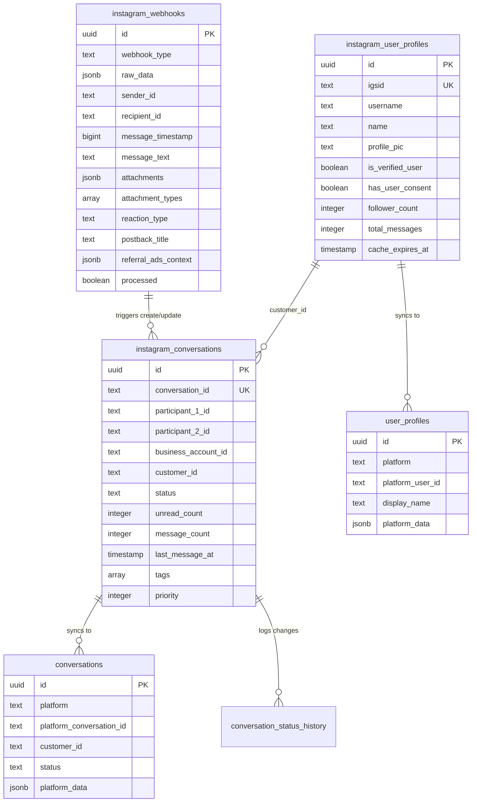

# AllChat - Instagram Webhook Manager 프로젝트 전체 문서

## 📌 프로젝트 개요

**AllChat**은 Instagram 비즈니스 계정의 Direct Message를 실시간으로 관리하는 통합 고객 상담 플랫폼입니다. Meta의 Instagram Graph API와 Webhook을 활용하여 고객과의 모든 대화를 중앙에서 효율적으로 관리할 수 있습니다.

### 핵심 가치
- **실시간 대화 관리**: 고객 메시지를 즉시 확인하고 응답
- **상태 기반 워크플로우**: 체계적인 상담 프로세스 관리
- **확장 가능한 아키텍처**: 향후 카카오톡, LINE 등 멀티 플랫폼 지원 준비

## 🛠 기술 스택

### Frontend
- **Framework**: Next.js 15.1.4 (App Router)
- **Language**: TypeScript 5
- **Styling**: Tailwind CSS v4
- **Build Tool**: Turbopack
- **Font**: Pretendard (한국어 최적화)
- **Icons**: Lucide React
- **Real-time**: Supabase Realtime Client

### Backend
- **Runtime**: Node.js 20+
- **API**: Next.js API Routes
- **Database**: Supabase (PostgreSQL 16)
- **Authentication**: SHA256 HMAC
- **External API**: Instagram Graph API v23.0

## 💾 데이터베이스 구조

### 멀티 플랫폼 아키텍처
현재는 Instagram에 최적화되어 있지만, 향후 카카오톡, LINE 등으로 확장 가능한 구조로 설계되었습니다.
- **Instagram 전용 테이블**: `instagram_*` 접두사
- **통합 테이블**: `conversations`, `user_profiles` (멀티 플랫폼 지원)
- **자동 동기화**: 트리거를 통해 Instagram 데이터가 통합 테이블로 자동 동기화

### ERD (Entity Relationship Diagram)



### 주요 테이블 상세

#### 1. `instagram_webhooks` (웹훅 이벤트 저장)
모든 Instagram 웹훅 이벤트의 상세 데이터를 저장합니다.

| 컬럼 | 타입 | 설명 |
|------|------|------|
| id | UUID | Primary Key |
| webhook_type | TEXT | 'message', 'reaction', 'postback', 'read', 'referral', 'ephemeral' |
| raw_data | JSONB | 원본 웹훅 페이로드 (완전한 데이터 보존) |
| sender_id | TEXT | 발신자 IGSID |
| recipient_id | TEXT | 수신자 IGSID |
| message_timestamp | BIGINT | Unix timestamp (밀리초) |
| message_id | TEXT | 메시지 고유 ID |
| message_text | TEXT | 메시지 텍스트 내용 |
| attachments | JSONB | 첨부파일 상세 정보 |
| attachment_types | TEXT[] | 첨부파일 타입 배열 |
| is_echo | BOOLEAN | 본인이 보낸 메시지 여부 |
| is_deleted | BOOLEAN | 삭제된 메시지 여부 |
| **반응 관련** | | |
| reaction_action | TEXT | 'react' or 'unreact' |
| reaction_type | TEXT | 반응 타입 |
| reaction_emoji | TEXT | 반응 이모지 |
| **포스트백** | | |
| postback_title | TEXT | 버튼 제목 |
| postback_payload | TEXT | 버튼 페이로드 |
| **리퍼럴** | | |
| referral_source | TEXT | 유입 경로 |
| referral_type | TEXT | 리퍼럴 타입 |
| referral_ads_context | JSONB | 광고 컨텍스트 |

#### 2. `instagram_conversations` (대화 관리)
Instagram 대화 스레드를 관리하는 핵심 테이블입니다.

| 컬럼 | 타입 | 설명 |
|------|------|------|
| id | UUID | Primary Key |
| conversation_id | TEXT | 고유 식별자 (UNIQUE, 'smaller_id_larger_id' 형식) |
| participant_1_id | TEXT | 참가자 1 IGSID (작은 ID) |
| participant_2_id | TEXT | 참가자 2 IGSID (큰 ID) |
| business_account_id | TEXT | 비즈니스 계정 ID |
| customer_id | TEXT | 고객 ID |
| status | TEXT | 'pending', 'in_progress', 'completed' (기본: 'pending') |
| status_updated_at | TIMESTAMP | 상태 변경 시간 |
| unread_count | INTEGER | 읽지 않은 메시지 수 (기본: 0) |
| message_count | INTEGER | 총 메시지 수 (기본: 0) |
| last_message_at | TIMESTAMP | 마지막 메시지 시간 |
| last_message_text | TEXT | 마지막 메시지 내용 |
| last_sender_id | TEXT | 마지막 발신자 ID |
| assigned_to | TEXT | 담당 상담원 ID |
| priority | INTEGER | 우선순위 (0-10, 기본: 0) |
| tags | TEXT[] | 태그 배열 |
| notes | TEXT | 상담 메모 |

#### 3. `instagram_user_profiles` (사용자 프로필)
Instagram 사용자 프로필을 캐싱하고 관리합니다.

| 컬럼 | 타입 | 설명 |
|------|------|------|
| id | UUID | Primary Key |
| igsid | TEXT | Instagram Scoped ID (UNIQUE) |
| username | TEXT | Instagram 사용자명 |
| name | TEXT | 표시 이름 |
| profile_pic | TEXT | 프로필 사진 URL |
| follower_count | INTEGER | 팔로워 수 |
| is_verified_user | BOOLEAN | 인증 계정 여부 |
| is_user_follow_business | BOOLEAN | 사용자→비즈니스 팔로우 여부 |
| is_business_follow_user | BOOLEAN | 비즈니스→사용자 팔로우 여부 |
| has_user_consent | BOOLEAN | GDPR 동의 여부 (기본: true) |
| consent_granted_at | TIMESTAMP | 동의 시간 |
| cache_expires_at | TIMESTAMP | 캐시 만료 시간 (24시간) |
| last_fetched_at | TIMESTAMP | 마지막 API 조회 시간 |
| fetch_count | INTEGER | API 호출 횟수 |
| fetch_error | TEXT | API 에러 메시지 |
| first_message_at | TIMESTAMP | 첫 메시지 시간 |
| last_message_at | TIMESTAMP | 마지막 메시지 시간 |
| total_messages | INTEGER | 총 메시지 수 |
| is_active | BOOLEAN | 활성 상태 (기본: true) |
| notes | TEXT | 관리자 메모 |
| raw_profile_data | JSONB | Instagram API 원본 응답 |

#### 4. `conversations` (통합 대화 테이블)
모든 플랫폼의 대화를 통합 관리하기 위한 테이블입니다.

| 컬럼 | 타입 | 설명 |
|------|------|------|
| id | UUID | Primary Key |
| platform | TEXT | 플랫폼 ('instagram', 'kakao', 'line' 등) |
| platform_conversation_id | TEXT | 플랫폼별 대화 ID |
| customer_id | TEXT | 고객 ID |
| business_account_id | TEXT | 비즈니스 계정 ID |
| status | TEXT | 상태 ('pending', 'in_progress' 등) |
| platform_data | JSONB | 플랫폼별 추가 데이터 |

#### 5. `user_profiles` (통합 프로필 테이블)
모든 플랫폼의 사용자 프로필을 통합 관리합니다.

| 컬럼 | 타입 | 설명 |
|------|------|------|
| id | UUID | Primary Key |
| platform | TEXT | 플랫폼 |
| platform_user_id | TEXT | 플랫폼별 사용자 ID |
| display_name | TEXT | 표시 이름 |
| username | TEXT | 사용자명 |
| profile_pic | TEXT | 프로필 사진 URL |
| platform_data | JSONB | 플랫폼별 추가 데이터 |

#### 6. `conversation_status_history` (상태 변경 이력)
대화 상태 변경 이력을 추적합니다.

| 컬럼 | 타입 | 설명 |
|------|------|------|
| id | UUID | Primary Key |
| conversation_id | TEXT | 대화 ID (FK to instagram_conversations) |
| old_status | TEXT | 이전 상태 |
| new_status | TEXT | 새 상태 |
| changed_by | TEXT | 변경자 |
| reason | TEXT | 변경 사유 |
| platform | TEXT | 플랫폼 (기본: 'instagram') |

### 📐 데이터베이스 인덱스 전략

총 45개의 인덱스로 쿼리 성능을 최적화합니다:

#### instagram_webhooks (17개 인덱스)
- **기본 검색**: `idx_webhooks_sender_id`, `idx_webhooks_recipient_id`
- **시간 기반**: `idx_webhooks_created_at`, `idx_webhooks_message_timestamp`
- **대화 조회**: `idx_webhooks_conversation` (conversation_id)
- **타입별 필터**: `idx_webhooks_webhook_type`
- **JSONB 검색**: `idx_webhooks_raw_data` (GIN index)
- **처리 상태**: `idx_webhooks_processed`, `idx_webhooks_unprocessed`

#### instagram_conversations (11개 인덱스)
- **고유 제약**: `conversations_conversation_id_key`
- **참가자 검색**: `idx_conversations_participants`, `idx_conversations_customer_id`
- **상태 관리**: `idx_conversations_status_updated`
- **읽지않은 메시지**: `idx_conversations_unread`
- **우선순위**: `idx_conversations_priority`
- **태그 검색**: `idx_conversations_tags`

#### instagram_user_profiles (7개 인덱스)
- **기본 검색**: `idx_user_profiles_igsid`, `idx_user_profiles_username`
- **캐시 관리**: `idx_user_profiles_cache_expires`
- **통계**: `idx_user_profiles_follower_count`, `idx_user_profiles_last_message`

### ⚙️ 데이터베이스 트리거

8개의 트리거가 자동으로 데이터를 관리합니다:

#### 1. `update_conversation_on_webhook`
**트리거**: instagram_webhooks INSERT 후
**기능**: 웹훅 수신 시 대화 자동 생성/업데이트
- 새 대화 생성 또는 기존 대화 업데이트
- unread_count 증가 (고객 메시지인 경우)
- last_message_at, last_message_text 갱신
- 상태 자동 변경 (completed → in_progress)

#### 2. `increment_conversation_message_count`
**트리거**: instagram_webhooks INSERT 후
**기능**: 대화의 message_count 자동 증가

#### 3. `log_status_change_trigger`
**트리거**: instagram_conversations UPDATE 후
**기능**: 상태 변경을 conversation_status_history에 기록

#### 4. `sync_instagram_conversations_to_unified`
**트리거**: instagram_conversations INSERT/UPDATE 후
**기능**: Instagram 대화를 통합 conversations 테이블로 동기화

#### 5. `sync_instagram_profiles_to_unified`
**트리거**: instagram_user_profiles INSERT/UPDATE 후
**기능**: Instagram 프로필을 통합 user_profiles 테이블로 동기화

#### 6. `sync_profile_cache`
**트리거**: user_profiles INSERT/UPDATE 후
**기능**: 프로필 캐시를 conversations 테이블에 동기화

#### 7. `update_conversation_updated_at_trigger`
**트리거**: instagram_conversations UPDATE 전
**기능**: updated_at 타임스탬프 자동 갱신

#### 8. `update_user_profile_updated_at_trigger`
**트리거**: instagram_user_profiles UPDATE 전
**기능**: 프로필 updated_at 타임스탬프 자동 갱신

### 🔧 데이터베이스 함수

11개의 저장 함수로 복잡한 로직을 처리합니다:

#### 1. `get_conversation_status_counts(p_platform TEXT)`
상태별 대화 수를 집계합니다.
```sql
RETURNS TABLE(
  active_count BIGINT,
  pending_count BIGINT, 
  in_progress_count BIGINT,
  completed_count BIGINT,
  total_count BIGINT
)
```

#### 2. `get_or_create_user_profile(user_igsid TEXT)`
사용자 프로필을 조회하거나 없으면 생성합니다.

#### 3. `profile_needs_refresh(profile_id UUID)`
프로필 캐시가 만료되었는지 확인합니다.

#### 4. 트리거 함수들
- `update_or_create_instagram_conversation()`
- `increment_message_count()`
- `log_conversation_status_change()`
- `sync_instagram_to_unified_conversations()`
- `sync_instagram_profile_to_unified()`
- `sync_profile_cache_to_conversations()`
- `update_conversation_updated_at()`
- `update_user_profile_updated_at()`

## 🔄 API 구조

### 웹훅 엔드포인트

#### `GET /api/webhooks/instagram`
Meta의 웹훅 검증 요청을 처리합니다.
```typescript
// 검증 토큰 확인
if (hub.verify_token === process.env.INSTAGRAM_WEBHOOK_VERIFY_TOKEN) {
  return hub.challenge // 검증 성공
}
```

#### `POST /api/webhooks/instagram`
실제 웹훅 이벤트를 수신하고 처리합니다.
```typescript
// SHA256 서명 검증
const signature = crypto
  .createHmac('sha256', APP_SECRET)
  .update(rawBody)
  .digest('hex')

// 웹훅 타입별 처리
switch (webhookType) {
  case 'message': // 메시지 처리
  case 'reaction': // 반응 처리
  case 'postback': // 버튼 클릭 처리
  // ...
}
```

### 대화 관리 API

#### `GET /api/conversations`
대화 목록을 조회합니다.
```typescript
// 상태별 필터링
const conversations = await supabase
  .from('instagram_conversations')
  .select(`*, customer_profile:instagram_user_profiles(*)`)
  .eq(status ? 'status' : '', status)
  .order('last_message_at', { ascending: false })
```

#### `GET /api/conversations/[id]/messages`
특정 대화의 메시지를 페이징하여 조회합니다.
```typescript
// 50개씩 페이징
const messages = await supabase
  .from('instagram_webhooks')
  .select('*')
  .eq('conversation_id', id)
  .order('created_at', { ascending: false })
  .range(offset, offset + 49)
```

#### `PUT /api/conversations/[id]/status`
대화 상태를 변경합니다.
```typescript
// 상태 업데이트
await supabase
  .from('instagram_conversations')
  .update({ status: newStatus })
  .eq('conversation_id', id)
```

### 메시지 전송 API

#### `POST /api/messages/send`
Instagram Graph API를 통해 메시지를 전송합니다.

```typescript
// 텍스트 메시지 전송
const response = await fetch(
  `https://graph.instagram.com/v23.0/me/messages`,
  {
    method: 'POST',
    body: JSON.stringify({
      recipient: { id: recipientId },
      message: { text: messageContent }
    })
  }
)
```

지원하는 메시지 타입:
- `text`: 텍스트 메시지
- `image`: 이미지 (최대 8MB)
- `video`: 비디오 (최대 25MB)
- `audio`: 오디오 (최대 25MB)
- `sticker`: 하트 스티커
- `reaction`: 메시지 반응
- `media_share`: 게시물 공유

## 🎨 UI/UX 구조

### 3컬럼 레이아웃

```
┌─────────────────────────────────────────────────────┐
│                    Header (Optional)                 │
├──────────┬─────────────────────┬───────────────────┤
│          │                     │                     │
│  고객    │                     │                     │
│  메시지  │      대화 창        │   상담 도구        │
│  목록    │                     │                     │
│  (25%)   │      (50%)         │     (25%)          │
│          │                     │                     │
└──────────┴─────────────────────┴───────────────────┘
```

### 컴포넌트 구조

```typescript
// 메인 페이지 구조
<ConversationsPage>
  <ConversationsList />    // 좌측: 대화 목록
  <ConversationView />     // 중앙: 채팅 뷰
  <ConsultationAssistant /> // 우측: 상담 도구
</ConversationsPage>
```

### 주요 UI 컴포넌트

#### 1. ConversationsList (대화 목록)
- **상태 필터 탭**: 진행 중, 전체, 완료
- **대화 카드**: 
  - 고정 높이 80px
  - 프로필 이미지 40x40px
  - 2줄 메시지 미리보기
  - 읽지 않은 수 뱃지
  - 플랫폼 아이콘

#### 2. ConversationView (대화창)
- **헤더**: 고객명 + 플랫폼 아이콘 + 상태 변경 버튼
- **메시지 영역**: 
  - 날짜별 그룹화
  - 발신자별 말풍선 스타일
  - 이미지/동영상 미리보기
- **입력창**: 
  - 둥근 모서리 (rounded-2xl)
  - 종이비행기 전송 버튼 (45도 회전)
  - 파일 첨부 버튼 (준비 중)

#### 3. ConsultationAssistant (상담 도구)
- 기본 구조만 구현
- 향후 확장 예정 (템플릿, AI 응답 등)

### 디자인 시스템

#### 색상 팔레트
```css
/* Primary */
--blue-500: #3B82F6  /* 전송 버튼, 활성 탭 */
--blue-600: #2563EB  /* 호버 상태 */

/* Neutral */
--gray-50: #F9FAFB   /* 배경 */
--gray-200: #E5E7EB  /* 테두리 */
--gray-300: #D1D5DB  /* 입력창 테두리 */
--gray-500: #6B7280  /* 보조 텍스트 */
--gray-900: #111827  /* 메인 텍스트 */

/* Status */
--red-500: #EF4444   /* 읽지 않은 뱃지 */
--green-500: #10B981 /* 완료 상태 */
--orange-500: #F59E0B /* 진행 중 카운트 */
```

#### 타이포그래피
- **폰트**: Pretendard (한국어 최적화)
- **크기**: 
  - 헤더: text-base (16px)
  - 본문: text-sm (14px)
  - 보조: text-xs (12px)
  - 카운트: text-[10px]

## 🔄 실시간 기능

### Supabase Realtime 구독

```typescript
// 웹훅 실시간 구독
const channel = supabase
  .channel('instagram-webhooks')
  .on('postgres_changes', 
    { event: 'INSERT', table: 'instagram_webhooks' },
    (payload) => {
      // 새 메시지 처리
      addNewMessage(payload.new)
    }
  )
  .subscribe()
```

### 낙관적 업데이트 (Optimistic Update)

```typescript
// 1. 즉시 UI 업데이트
setMessages(prev => [...prev, optimisticMessage])

// 2. API 호출
const response = await sendMessage(messageData)

// 3. 성공/실패 처리
if (response.ok) {
  // Echo 웹훅으로 실제 메시지 대체
} else {
  // 실패 표시 및 재전송 옵션
}
```

## 📊 상태 관리 시스템

### 상담 워크플로우

```
[새 메시지 수신] → [new/pending]
        ↓
[상담원 답장] → [in_progress]
        ↓
[상담 완료 클릭] → [completed]
        ↓
[새 메시지 수신] → [자동 재개: in_progress]
```

### 상태별 UI 표현
- **new**: 왼쪽 테두리 주황색
- **in_progress**: 왼쪽 테두리 파란색
- **completed**: 배경색 회색 처리

## 🔐 보안

### 웹훅 서명 검증

```typescript
function verifySignature(payload: string, signature: string): boolean {
  const expected = crypto
    .createHmac('sha256', APP_SECRET)
    .update(payload)
    .digest('hex')
  
  return crypto.timingSafeEqual(
    Buffer.from(signature),
    Buffer.from(`sha256=${expected}`)
  )
}
```

### 환경 변수 관리
```env
# Supabase
NEXT_PUBLIC_SUPABASE_URL=
NEXT_PUBLIC_SUPABASE_ANON_KEY=

# Instagram Webhook
INSTAGRAM_WEBHOOK_VERIFY_TOKEN=
INSTAGRAM_APP_SECRET=

# Instagram API
INSTAGRAM_USER_ACCESS_TOKEN=
INSTAGRAM_BUSINESS_ID=
```

## 🚀 성능 최적화

### 데이터베이스 최적화
- **인덱싱**: 
  ```sql
  CREATE INDEX idx_conversations_status ON instagram_conversations(status);
  CREATE INDEX idx_webhooks_conversation ON instagram_webhooks(conversation_id);
  CREATE INDEX idx_webhooks_created ON instagram_webhooks(created_at DESC);
  ```

- **GIN 인덱스**: JSONB 검색 최적화
  ```sql
  CREATE INDEX idx_webhooks_raw_data ON instagram_webhooks USING GIN(raw_data);
  ```

### 프론트엔드 최적화
- **페이징**: 메시지 50개씩 로드
- **메모이제이션**: useMemo로 연산 캐싱
- **디바운싱**: 검색 입력 디바운싱
- **가상 스크롤**: 대량 메시지 렌더링 최적화 (예정)

### API 최적화
- **프로필 캐싱**: 24시간 캐시
- **배치 처리**: 여러 프로필 한번에 조회
- **Rate Limiting**: Instagram API 제한 준수

## 📈 모니터링 및 로깅

### 에러 처리
```typescript
try {
  // API 호출
} catch (error) {
  console.error('[API Error]', {
    endpoint,
    error: error.message,
    timestamp: new Date().toISOString()
  })
  // 사용자 친화적 에러 메시지
  return { error: '일시적인 오류가 발생했습니다.' }
}
```

### 웹훅 로깅
- 모든 웹훅 raw_data 저장
- 처리 실패 시 재시도 큐 (예정)
- 웹훅 통계 대시보드 (예정)

## 🔮 향후 로드맵

### 단기 계획 (1-2개월)
- [ ] 파일 첨부 전송 구현
- [ ] 메시지 검색 기능
- [ ] 상담 템플릿 시스템
- [ ] 팀 협업 기능 (멘션, 노트)

### 중기 계획 (3-6개월)
- [ ] 카카오톡 채널 연동
- [ ] LINE 공식 계정 연동
- [ ] 통합 대시보드
- [ ] AI 기반 자동 응답

### 장기 계획 (6개월+)
- [ ] WhatsApp Business 연동
- [ ] Facebook Messenger 연동
- [ ] 고객 CRM 통합
- [ ] 분석 및 리포팅 시스템

## 🛠 개발 가이드

### 프로젝트 설치
```bash
# 저장소 클론
git clone https://github.com/your-org/instagram-webhook-manager.git

# 의존성 설치
npm install

# 환경 변수 설정
cp .env.example .env.local
# .env.local 파일 수정

# 개발 서버 실행
npm run dev
```

### 데이터베이스 마이그레이션
```sql
-- Supabase SQL Editor에서 실행
-- 1. 스키마 생성
\i supabase_schema_v2.sql

-- 2. 트리거 설정
\i auto_reopen_on_message.sql
```

### 프로덕션 배포
```bash
# 빌드
npm run build

# 프로덕션 실행
npm start

# 또는 Vercel 배포
vercel deploy
```

## 📚 참고 문서

- [Instagram Graph API Documentation](https://developers.facebook.com/docs/instagram-api)
- [Instagram Webhooks Guide](https://developers.facebook.com/docs/instagram-api/guides/webhooks)
- [Supabase Documentation](https://supabase.com/docs)
- [Next.js 15 Documentation](https://nextjs.org/docs)

## 👥 기여 가이드

### 코드 스타일
- TypeScript strict mode 준수
- Prettier + ESLint 설정 따르기
- 컴포넌트는 함수형으로 작성
- Custom hooks로 로직 분리

### 커밋 메시지
```
feat: 새로운 기능 추가
fix: 버그 수정  
docs: 문서 수정
style: 코드 포맷팅
refactor: 코드 리팩토링
test: 테스트 추가
chore: 빌드 업무 수정
```

## 📄 라이선스

MIT License - 자유롭게 사용, 수정, 배포 가능

---

**Last Updated**: 2025-08-26
**Version**: 1.0.0
**Author**: AllChat Development Team